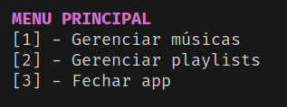
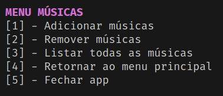
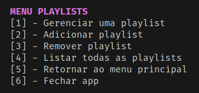
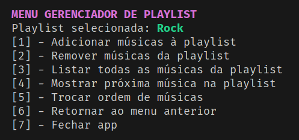

# GERENCIADOR DE MÚSICAS E PLAYLISTS - CLI

Antes de tudo gostaria de deixar os link do [repositório do github](https://github.com/lucasnike/LP1-PROJETO-SPOTFY-CLI), e da [documentação do projeto](https://lucasnike.github.io/LP1-PROJETO-SPOTFY-CLI/) para consultas mais detalhadas.

## Discentes
| Nome        | Matricula   |
| ----------- | ----------- |
| Lucas Vinicius Pereira da Silva      | 20220060694       |
| Itallo Muriel Moreira Cortez   | 20220075024        |
## O que é?
<hr/>

O projeto se trata de uma CLI(Comand line interface), totalmente programada em C++, que oferece ferramentas pare gerenciamento de "músicas" e "playlists", com o intuito de aprender a implementar uma lista encadeada de tipo genérico. Esse projeto faz parte da primeira unidade da matéria LP1(Liguagem de programação 1) do curso BTI(Bacharelado em tecnologia da informação) da UFRN(Universidade federal do Rio Grande do Norte).

## Compilar o projeto
<hr/>

Para compilar o projeto basta instalar o cmake, após a instalação execute o seguinte comando no terminal:

~~~bash
cmake ./CMakeLists.txt
~~~
Esse comando irá gerar um arquivo Makefile no diretório raiz do projeto. Então ao executar:
~~~bash
make
~~~
O projeto será combilado e um arquivo chamado **spotfy_cli** será gerado automaticamente.
## Estruturas de pastas
<hr/>

O projeto contém duas pastas relevantes, a pasta **src/** que contem os arquivos de implementação e **include/** que contém os arquivos de definição.
```c++
src
├── DisplayMenus.cpp
├── Main.cpp
├── Menu.cpp
├── Music.cpp
├── MusicsManager.cpp
├── Playlist.cpp
├── PlaylistManager.cpp
├── PlaylistMusicsManager.cpp
└── TerminalColors.cpp
```

```c++
include/
├── Definitions.hpp
├── DisplayMenus.hpp
├── ListaEncadeada
│   ├── List.hpp
│   └── Node.hpp
├── Menu.hpp
├── Music.hpp
├── MusicManager.hpp
├── Playlist.hpp
├── PlaylistManager.hpp
├── PlaylistMusicsManager.hpp
└── TerminalColors.hpp
```
## Menus do projeto

### Menu principal


### Menu de músicas


### Menu de playlists


### Menu de músicas de uma playlist

